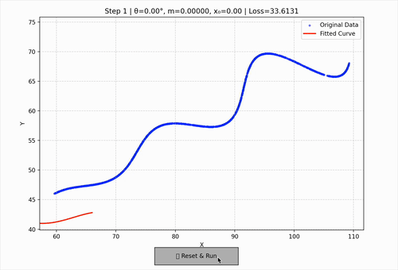

# Hill Climbing — Curve Fitting


**Model**

```
x(t) = t*cos(θ) - e*sin(θ) + x₀  
y(t) = 42 + t*sin(θ) + e*cos(θ)  
e = e^(m|t|) * sin(0.3t)
```

**Parameter Bounds**

* θ ∈ [0, 50]
* m ∈ [-0.05, 0.05]
* x₀ ∈ [0, 100]
* t ∈ [6, 66]

---

**Loss Function**
For each of 1500 given points and 1500 calculated points,
the Manhattan distance between corresponding pairs is computed and summed.

---

**Hill Climbing Algorithm**
A bounded local search that maintains the top-K best states.

* Start: (θ, m, x₀) = (25, 0, 50)
* Step sizes: Δ = {θ: 1, m: 0.001, x₀: 1}
* K (top results): 5
* Patience (no improvement limit): 10

Process:

1. Start with the midpoint parameters.
2. Generate 6 neighboring states by adding and subtracting step sizes.
3. Compute loss for each state and push into a min-heap.
4. Move to the state with the lowest loss only if it improves the result.
5. Stop if no improvement occurs for 10 consecutive iterations.

---

**Final Output**
θ = 30°, m = 0.03, x₀ = 55


<video controls width="640" height="360">
    <source src="graph.mp4" type="video/mp4">
    Your browser does not support the video tag.
</video>